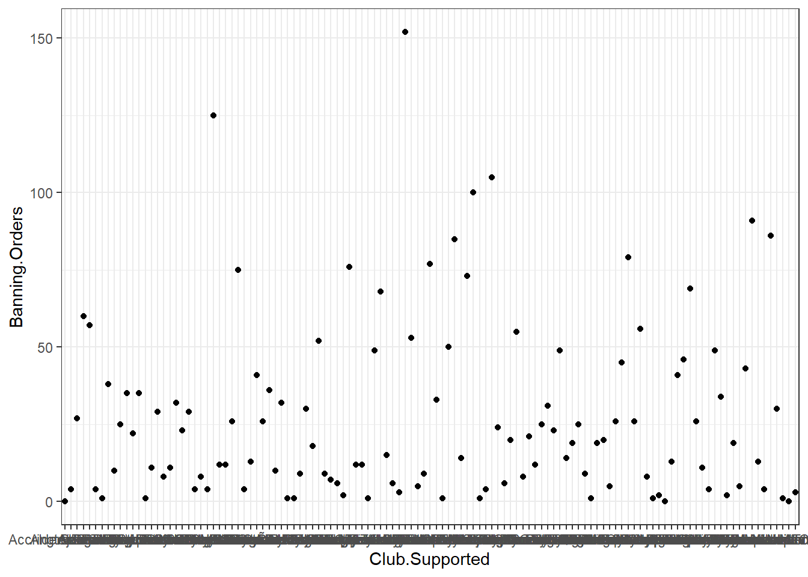
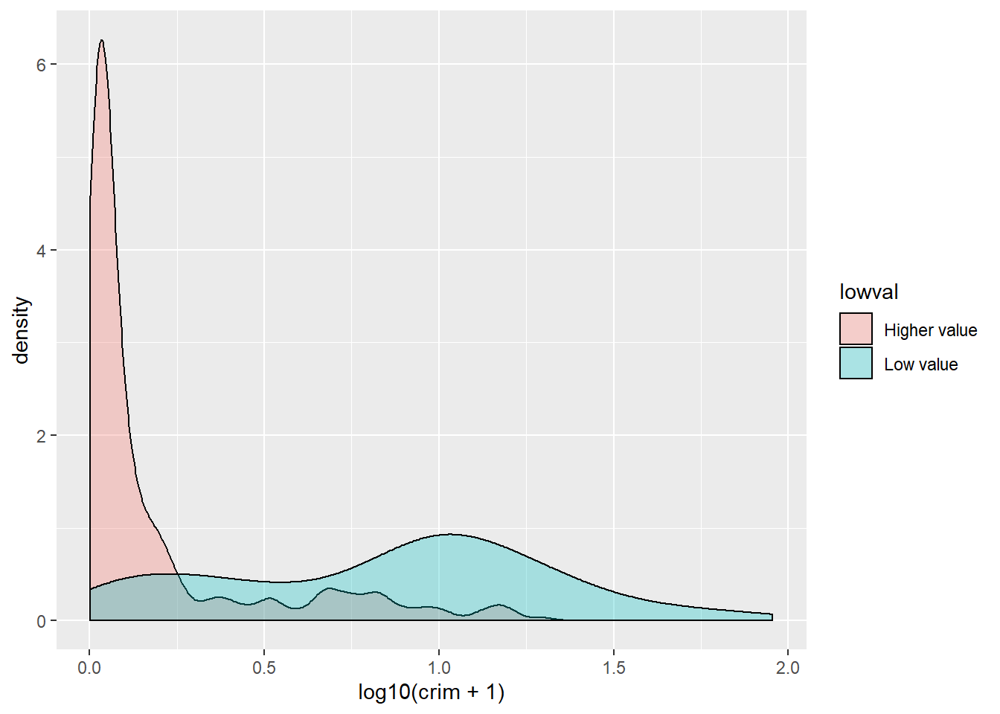
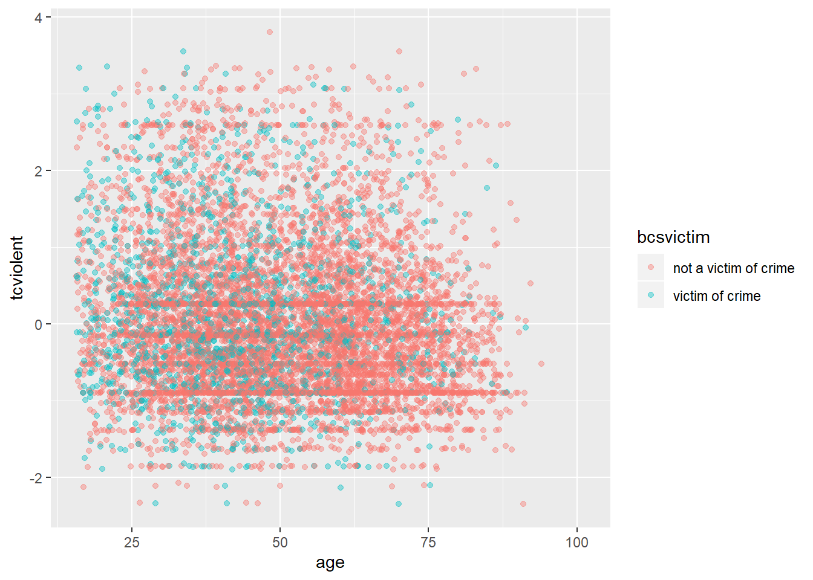
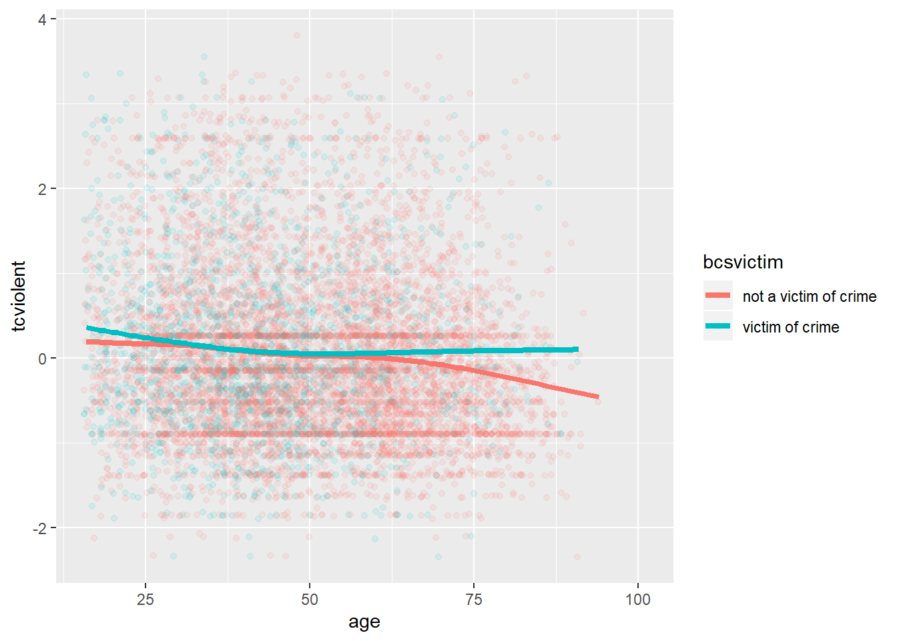
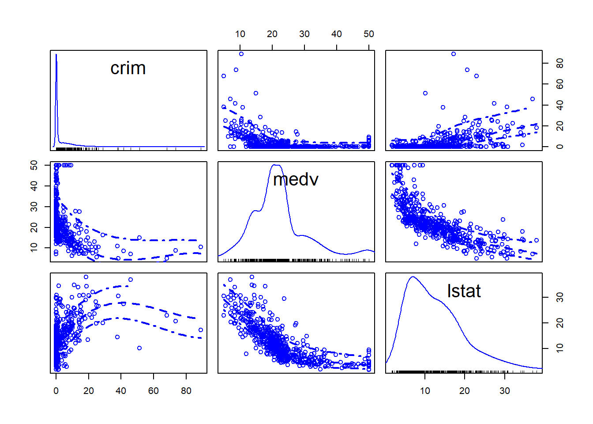
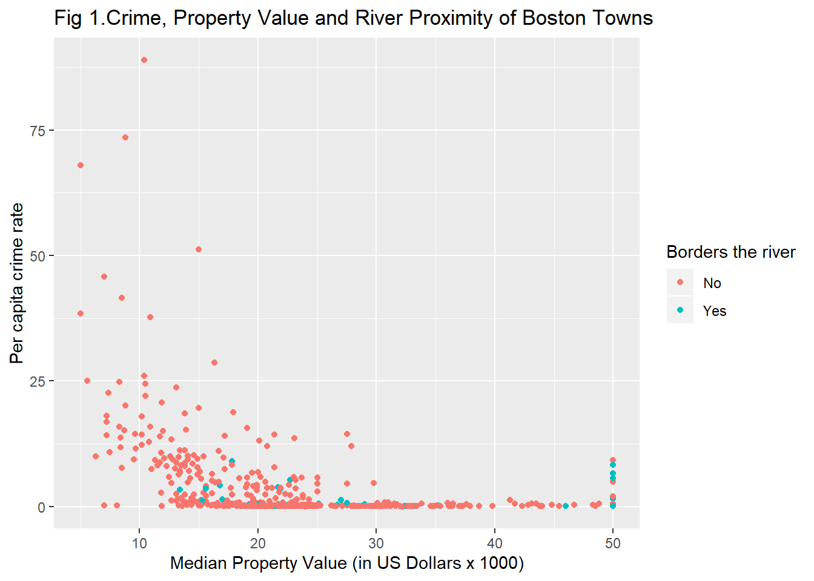
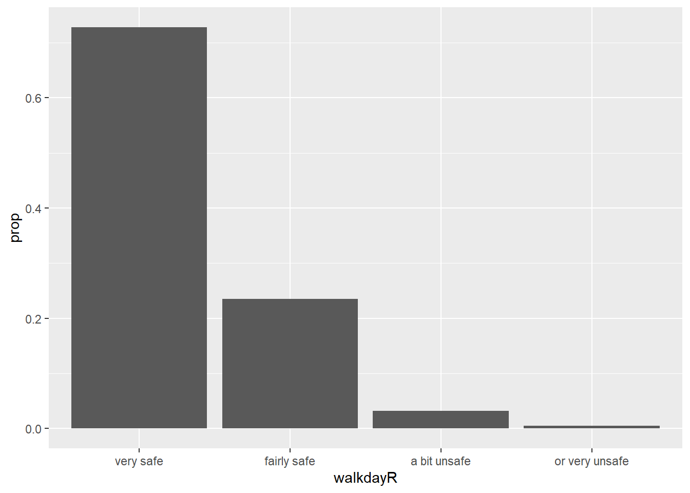
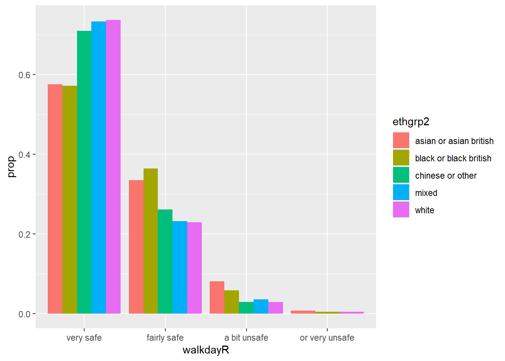
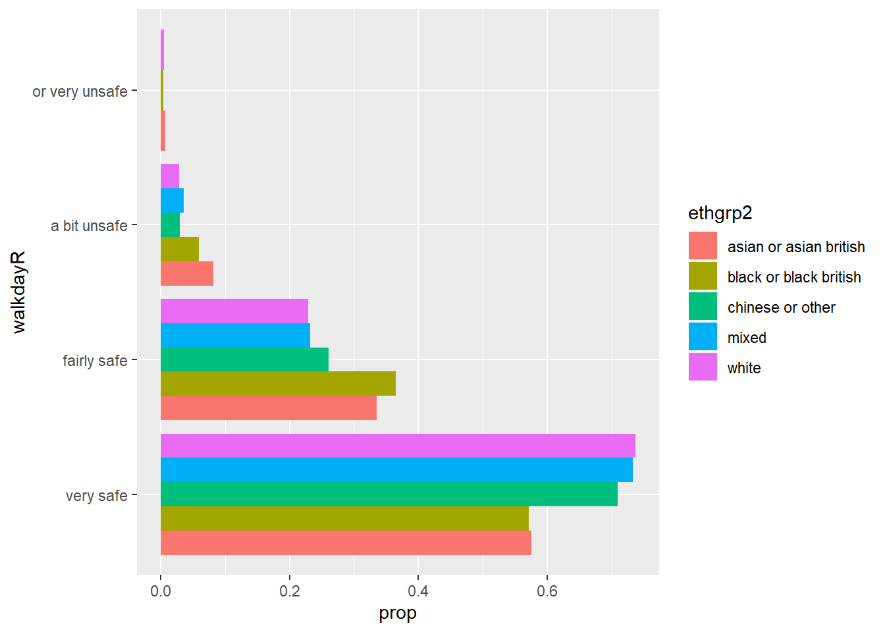

#Data visualisation with R (Week 3)

##Introduction

A picture is worth a thousand words; when presenting and interpreting data this basic idea also applies. There has been, indeed, a growing shift in data analysis toward more visual approaches to both interpretation and dissemination of numerical analysis. Part of the new data revolution consists in the mixing of ideas from visualisation of statistical analysis and visual design. Indeed data visualisation is one of the most interesting areas of development in the field.

Good graphics not only help researchers to make their data easier to understand by the general public. They are also a useful way for understanding the data ourselves. In many ways it is very often a more intuitive way to understand patterns in our data than trying to look at numerical results presented in a tabular form. 

Recent research has revealed that papers which have good graphics are perceived as overall more clear and more interesting, and their authors perceived as smarter (see [this presentation](https://vimeo.com/181771433))

The preparation for this session includes many great resources on visualising quantitative information, and if you have not had time to go through them, I recommend that you take some time to do so. 

As with other aspects of R, there are a number of core functions that can be used to produced graphics. However these offer limited possibilities for building graphs. 

The package we will be using throughout this tutorial is `ggplot2`. The aim of `ggplot2` is to implement the [grammar of graphics](http://www.springer.com/statistics/computational+statistics/book/978-0-387-24544-7). The `ggplot2` package has excellent online [documentation](http://ggplot2.org/) and is becoming an industry standard in some sectors. [Here](https://medium.com/bbc-visual-and-data-journalism/how-the-bbc-visual-and-data-journalism-team-works-with-graphics-in-r-ed0b35693535) for example you can read about how the BBC uses as part of their News service.

If you don't already have the package installed (check you do), you will need to do so using the `install.packages()` function. 
 
 You will then need to load up the package
 

```r
library(ggplot2)                                  
```

The grammar of graphics upon which this package is based on defines various components of a graphic. Some of the most important are:

-**The data**: For using `ggplot2` the data has to be stored as a data frame or tibble.

-**The geoms**: They describe the objects that represent the data (e.g., points, lines, polygons, etc..). This is what gets drawn. And you can have various different types layered over each other in the same visualisation.

-**The aesthetics**: They describe the visual characteristics that represent data (e.g., position, size, colour, shape, transparency).

-**Facets**: They describe how data is split into subsets and displayed as multiple small graphs.

-**Stats**: They describe statistical transformations that typically summarise data.

Let's take it one step at the time.

##Anatomy of a plot

Essentially the philosophy behind this is that all graphics are made up of layers. The package `ggplot2` is based on the grammar of graphics, the idea that you can build every graph from the same few components: a data set, a set of geoms—visual marks that represent data points, and a coordinate system.

Take this example (all taken from *Wickham, H. (2010). A layered grammar of graphics. Journal of Computational and Graphical Statistics, 19(1), 3-28.*)

You have a table such as: 


You then want to plot this. To do so, you want to create a plot that combines the following layers: 


This will result in a final plot: 


Let's have a look at what this looks like for a graph. 

Let's have a look at some data about [banning orders](https://www.gov.uk/government/publications/football-related-arrests-and-banning-orders-england-and-wales-season-2016-to-2017/football-related-arrests-and-banning-order-statistics-england-and-wales-2016-to-2017-season) for different football clubs. 

First you need to read the data. We keep this data in a website and you can download it with the following code:


```r
fbo_url <- "https://raw.githubusercontent.com/maczokni/R-for-Criminologists/master/fbo-by-club-supported-cleaned.csv"
fbo <- read.csv(url(fbo_url))
```

Now let's explore the question of number of banning orders for clubs in different leagues. But as a first step, let's just plot the number of banning orders for each club. Let's build this plot:


```r
ggplot(data = fbo, aes(x = Club.Supported, y=Banning.Orders)) +          #data
   geom_point() +                 #geometry
  theme_bw()                     #backgroud coordinate system
```



The first line above begins a plot by calling the `ggplot()` function, and putting the data into it. You have to name your dataframe, and then, within the `aes()` command you pass the specific variables which you want to plot. In this case, we only want to see the distribution of one variable, banning orders, in the y axis and we will plot the club supported in the x axis. 

The second line is where we add the geometry. This is where we tell R what we want the graph to be. Here we say we want it to be points by using geom_points. You can see a list of all possible geoms [here](http://docs.ggplot2.org/current/). 

The third line is where we can tweak the display of the graph. Here I used `theme_bw()` which is a nice clean theme. You can try with other themes. To get a list of themes you can also see the resource [here](http://docs.ggplot2.org/current/). If you want more variety you can explore the package [`ggthemes`](https://yutannihilation.github.io/allYourFigureAreBelongToUs/ggthemes/). 


```r
ggplot(data = fbo, aes(x = Club.Supported, y=Banning.Orders)) +     #data
   geom_point() +                                                   #geometry
  theme_dark()                                                      #backgroud coordinate system
```


Changing the theme is not all you can do with the third element. For example here you can't really read the axis labels, because they're all overlapping. One solution would be to rotate your axis labels 90 degrees, with the following code: `axis.text.x = element_text(angle = 90, hjust = 1)`. You pass this code to the theme argument. 


```r
ggplot(data = fbo, aes(x = Club.Supported, y=Banning.Orders)) +     
   geom_point() +                                                   
  theme(axis.text.x = element_text(angle = 90, hjust = 1))                                   
```


OK what if we don't want it to be points, but instead we wanted it to be a bar graph?


```r
ggplot(data = fbo, aes(x = Club.Supported, y=Banning.Orders)) +   #data
   geom_bar(stat = "identity") +                                  #geometry
  theme(axis.text.x = element_text(angle = 90, hjust = 1))                                                       #backgroud coordinate system
```


You might notice here we pass an argument `stat = "identity"` to `geo_bar()` function. This is because you can have a bar graph where the height of the bar shows frequency (stat = "count"), or where the height is taken from a variable in your dataframe (stat = "identity"). Here we specified a y-value (height) as the Banning.Orders variable. 

So this is cool! But what if I like both?

Well this is the beauty of the layering approach of `ggplot2`. You can layer on as many geoms as your little heart desires! XD


```r
ggplot(data = fbo, aes(x = Club.Supported, y=Banning.Orders)) +  #data
  geom_bar(stat = "identity") +                                  #geometry 1 
  geom_point()+                                                  #geometry 2
theme(axis.text.x = element_text(angle = 90, hjust = 1))                                                      #backgroud coordinate system
```


You can add other things too. For example you can add the mean number of Banning.Orders:


```r
ggplot(data = fbo, aes(x = Club.Supported, y=Banning.Orders)) +  #data
  geom_bar(stat = "identity") +                                  #geometry 1 
  geom_point() +                                                 #geometry 2
  geom_hline(yintercept = mean(fbo$Banning.Orders)) +            #mean line
theme(axis.text.x = element_text(angle = 90, hjust = 1))                                                      #backgroud coordinate system
```


This is basically all you need to know to build a graph! So far we have introduced a lot of code some of which you may not fully understand. Don't worry too much, we just wanted to give you a quick introduction to some of the possibilities. Later in the session we will go back to some of these functions in a slower way. The take away from this section is to understand the basic elements of the grammar of graphics.

##What graph should I use?

There are a lot of points to consider when you are choosing what graph to use to visually represent your data. There are some best practice guidelines, but at the end of the day, you need to consider what is best for your data. What do you want to show? What graph will best communicate your message? Is it a comparison between groups? Is it the frequency distribution of 1 variable? 

As some guidance, you can use the below [cheatsheet, taken from Nathan Yau's blog Flowingdata](https://flowingdata.com/2009/01/15/flow-chart-shows-you-what-chart-to-use/):


However, keep in mind that this is more of a guideline, aimed to nudge you in the right direction. There are many ways to visualise the same data, and sometimes you might want to experiment with some of these, see what the differences are. 

There is also a vast amount of research into what works in displaying quantitative information. The classic book is by Edward Tufte [^1], but since him there are many other researchers as well who focus on approaches to displaying data. Two useful books you may want to consider are Few (2012) [^2] and Cairo (2016) [^3]. Claus Wilke is also producing a textbook freely available [in the internet](https://serialmentor.com/dataviz/).
These authors tend to produce recommendations on what to use (and not use) in certain contexts.  

For example, most data visualisation experts agree that you should not use 3D graphics unless there is a meaning to the third dimension. So using 3D graphics just for decoration, as in [this case](https://mir-s3-cdn-cf.behance.net/project_modules/disp/2505dd10837923.56030acd2ef20.jpg) is normally frowned upon. However there are cases when including a third dimension is vital to communicating your findings. See this [example](http://www.visualisingdata.com/2015/03/when-3d-works/).

Also often certain chart types are vilified. For example, the pie chart is one such example. A lot of people (including your course leader) really dislike pie charts, e.g. see [here](http://www.storytellingwithdata.com/blog/2011/07/death-to-pie-charts) or [here](http://www.businessinsider.com/pie-charts-are-the-worst-2013-6?IR=T). If you want to display proportion, research indicates that a square pie chart is more likely to be interpreted correctly by viewers see [here](https://eagereyes.org/blog/2016/a-reanalysis-of-a-study-about-square-pie-charts-from-2009).

Also, in some cases bar plots can hide important features of your data, and might not be the most appropriate means for comparison: 


This has lead to a [kickstarter campaign](https://www.kickstarter.com/projects/1474588473/barbarplots/description) around actually banning bar plots...!

So choosing the right plot and how to design the different elements of a plot is somehow of an art that requires practice and a good understanding of the data visualisation literature. Here we can only provide you with an introduction to some of these issues. At the end of the chapter we will also highlight additional resources you may want to explore on your own.

An important consideration is that the plot that you use depends on the data you are plotting, as well as the message you want to convey with the plot, the audience that is intended for, and even the format in which it will be presented (a website, a printed report, a power point presentation, etc.). So for example, returning again to the difference between number of banning orders between clubs in different leagues, what are some ways of plotting these?

One suggestion is to make a histogram for each one. You can use ggplot's `facet_wrap()` option to split graphs by a grouping variable. For example, to create a histogram of banning orders you write: 


```r
ggplot(data = fbo, aes(x = Banning.Orders)) + 
  geom_histogram()
```


Now to split this by *League.of.the.Club.Supported*, you use `facet_wrap()` in the coordinate layer of the plot.


```r
ggplot(data = fbo, aes(x = Banning.Orders)) + 
  geom_histogram() + 
  facet_wrap(~League.of.the.Club.Supported)
```


Well you can see there's different distribution in each league. But is this easy to compare? Maybe another approach would make it easier? 
Personally I like boxplots for showing distribution. So let's try:


```r
ggplot(data = fbo, aes(x = League.of.the.Club.Supported, y = Banning.Orders)) + 
  geom_boxplot() 
```


This makes the comparison significantly easier, right? But the order is strange! Remember we talked about factors in previous weeks? Well the good thing about factors is that we can arrange them in their natural order. If we don't describe an order, then R uses the alphabetical order. So let's reorder our factor. To do that we are specifying the levels in the order in which we want to be embedded within the factor. We use code we introduced last week to do this.


```r
fbo$League.of.the.Club.Supported <- factor(fbo$League.of.the.Club.Supported, levels = c("Premier League", "Championship", "League One", "League Two", "Other clubs"))
```

And now create the plot again!


```r
ggplot(data = fbo, aes(x = League.of.the.Club.Supported, y = Banning.Orders)) + 
  geom_boxplot() 
```


Now this is great! We can see that the higher the league the more banning orders they have. Any ideas why?

We'll now go through some examples of making graphs using `ggplot2` package stopping a bit more on each of them. 

##Visualising numerical variables: Histograms

[Histograms](http://www.learner.org/courses/againstallodds/unitpages/unit03.html) are useful ways of representing quantitative variables visually. 

As mentioned earlier, we will emphasise in this course the use of the `ggplot()` function. With `ggplot()` you start with a blank canvass and keep adding specific layers. The `ggplot()` function can specify the dataset and the aesthetics (the visual characteristics that represent the data). 

To get the data we're going to use here, load up the package "MASS" and then call the Boston data into your environment.


```r
library(MASS)
data(Boston)
```

This package has a dataframe called *Boston*. This has data about Housing Values in suburbs of Boston (USA). To access the codebook (how you find out what variables are) use the "?". 

OK so let's make a graph about the variable which represents the per capita crime rate by town (*crim*).

If you want to produce a histogram with the `ggplot` function you would use the following code:


```r
ggplot(Boston, aes(x = crim)) + 
  geom_histogram()
```


So you can see that `ggplot` works in a way that you can add a series of additional specifications (layers, annotations). In this simple plot the `ggplot` function simply maps *crim* as the variable to be displayed (as one of the **aesthetics**) and the dataset. Then you add the `geom_histogram` to tell R that you want this variable to be represented as a histogram. Later we will see what other things you can add.

A histogram is simply putting cases in "bins" and then creates a bar for each bin. You can think of it as a *visual grouped frequency distribution*. The code we have used so far has used a bin-width of size range/30 as R kindly reminded us in the output. But you can modify this parameter if you want to get a rougher or a more granular picture. In fact, you should *always* play around with different specifications of the bin-width until you find one that tells the full story in a parsimonious way.


```r
ggplot(Boston, aes(x = crim)) +
  geom_histogram(binwidth = 1) 
```


We can pass arguments to the the geoms, as you see. Here we are changing the size of the bins (for further details on other arguments you can check the help files). Using bin-width of 1 we are essentially creating a bar for every one unit increase in the percent rate of crime. We can still see that most towns have a very low level of crime.

Let's sum the number of towns with a value lower than 1 in the per capita crime rate. We use the sum function for this, specifying we are only interested in adding cases where the value of the variable *crim* is lower than 1.


```r
sum(Boston$crim < 1)
```

```
## [1] 332
```

We can see that the large majority of towns, 332 out of 506, have a per capita crime rate below 1%. But we can also see that there are some towns that have a high concentration of crime. This is a spatial feature of crime; it tends to concentrate in particular areas and places. You can see how we can use visualisations to show the data and get a first feeling for how it may be distributed.

When plotting a continuous variable we are interested in the following features:

+ **Asymmetry**: whether the distribution is skewed to the right or to the left, or follows a more symmetrical shape.
+ **Outliers**: Are there one or more values that seem very unlike the others?
+ **Multimodality**: How many peaks has the distribution? More than one peak may indicate that the variable is measuring different groups.
+ **Impossibilities or other anomalies**: Values that are simply unrealistic given what we are measuring (e.g., somebody with an age of a 1000 years). Sometimes you may come across a distribution of data with a very high (and implausible) frequency count for a particular value. Maybe you measure age and you have a large number of cases aged 99 (which is often a code used for missing data).
+ **Spread**: this gives us an idea of variability in our data.

Often we visualise data because we want to compare distributions. **Most of data analysis is about making comparisons**. We are going to explore whether the distribution of crime in this dataset is different for less affluent areas. The variable *medv* measures in the Boston dataset the median value of owner-occupied homes. For the purposes of this illustration I want to dichotomise[^4] this variable, to create a group of towns with particularly low values versus all the others. For further details in how to recode variables with R you may want to read the relevant sections in [Quick R](http://www.statmethods.net/management/variables.html) or the [R Cookbook](http://www.cookbook-r.com/Manipulating_data/Recoding_data/). We will learn more about recoding and transforming variables in R soon.

How can we create a categorical variable based on information from a quantitative variable? Let's see the following code and pay attention to it and the explanation below.


```r
Boston$lowval[Boston$medv <= 17.02] <- "Low value" 
Boston$lowval[Boston$medv > 17.02] <- "Higher value"
```

First we tell R to create a new vector (*lowval*) in the Boston data frame. This vector will be assigned the character value "Low value" when the condition within the square brackets is met. That is, we are saying that whenever the value in *medv* is below 17.02 then the new variable *lowval* will equal "Low value". I have chosen 17.02 as this is the first quartile for *medv*. Then we tell R that when the value is greater than 17.02 we will assign those cases to a new textual category called "Higher Value".

The variable we created was a character vector (as we can see if we run the class function). so we are going to transform it into a factor using the as.factor function (many functions designed to work with categorical variables expect a factor as an input, not just a character vector). If we rerun the class function we will see we changed the original variable


```r
class(Boston$lowval)
```

```
## [1] "character"
```

```r
Boston$lowval <- as.factor(Boston$lowval)
class(Boston$lowval)
```

```
## [1] "factor"
```

Now we can produce the plot. We will do this using **facets**. Facets are another element of the grammar of graphics, we use it to define subsets of the data to be represented as multiple groups, here we are asking R to produce two plots defined by the two levels of the factor we just created.


```r
ggplot(Boston, aes(x = crim)) +
  geom_histogram(binwidth = 1) +
  facet_grid(lowval ~ .) 
```


Visually this may not look great, but it begins to tell a story. We can see that there is a considerable lower proportion of towns with low levels of crime in the group of towns that have cheaper homes. It is a flatter, less skewed distribution. You can see how the `facet_grid()` expression is telling R to create the histogram of the variable mentioned in the `ggplot` function for the groups defined by the categorical input of interest (the factor *lowval*).

We could do a few things that may perhaps help to emphasise the comparison like, for example, adding colour to each of the groups.


```r
ggplot(Boston, aes(x = crim, fill = lowval)) +
  geom_histogram(binwidth = 1) +
  facet_grid(lowval ~ .) +
  theme(legend.position = "none")
```


The `fill` argument within the `aes` is telling R what variable to assign colours. Now each of the levels (groups) defined by the *lowval* variable will have a different colour. The `theme` statement that we add is telling R not to place a legend in the graphic explaining that red is higher value and the greenish colour is low value. We can already see that without a label.

Instead of using facets, we could overlay the histograms with a bit of transparency. Transparencies work better when projecting in screens than in printed document, so keep in mind this when deciding whether to use them instead of facets. The code is as follows:


```r
ggplot(Boston, aes(x = crim, fill = lowval)) + 
  geom_histogram(position = "identity", alpha = 0.4)
```


In the code above, the `fill` argument identifies again the factor variable in the dataset grouping the cases. Also, `position = identity` tells R to overlay the distributions and `alpha` asks for the degree of transparency, a lower value (e.g., 0.2) will be more transparent.

In this case, part of the problem we have is that the skew can make it difficult to appreciate the differences. When you are dealing with skewed distributions such as this, it is sometimes convenient to use a transformation [^5]. We will come back to this later this semester. For now suffice to say, that taking the logarithm of a skewed variable helps to reduce the skew and to see patterns more clearly. In order to visualise the differences here a bit better we could ask for the logarithm of the crime per capita rate. Notice how I also add a constant of 1 to the variable *crim*, this is to avoid NA values in the newly created variable if the value in *crim* is zero (you cannot take the log of 0).


```r
ggplot(Boston, aes(x = log10(crim + 1), fill = lowval)) +
  geom_histogram(position = "identity", alpha = 0.4)
```


The plot now is a bit clearer. It seems pretty evident that the distribution of crime is slightly different between these two types of towns.

##Visualising numerical variables: Density plots

For smoother distributions, you can use density plot. You should have a healthy amount of data to use these or you could end up with a lot of unwanted noise. Let's first look at the single density plot for all cases. Notice all we are doing is invoking a different kind of geom:


```r
ggplot(Boston, aes(x = crim)) +
  geom_density() 
```


In a density plot, we attempt to visualize the underlying probability distribution of the data by drawing an appropriate continuous curve. So in a density plot then the area under the lines sum to 1 and the Y, vertical, axis now gives you the estimated (guessed) probability for the different values in the X, horizontal, axis. This curve is guessed from the data and the method we use for this guessing or estimation is called kernel density estimation. You can read more about density plots [here](https://serialmentor.com/dataviz/histograms-density-plots.html).

In this plot we can see that there is a high estimated probability of observing a town with near zero per capita crime rate and a low estimated probability of seeing towns with large per capita crime rates. As you can observe it provides a smoother representation of the distribution (as compared to the histograms).

You can also use this to compare the distribution of a quantitative variable across the levels in a categorical variable (factor) and, as before, is possibly better to take the log of skewed variables such as crime:


```r
#We are mapping "lowval" as the variable colouring the lines 
ggplot(Boston, aes(x = log10(crim + 1), colour = lowval)) + 
  geom_density() 
```


Or you could use transparencies:


```r
ggplot(Boston, aes(x = log10(crim + 1), fill = lowval)) + 
  geom_density(alpha = .3)
```



Did you notice the difference with the comparative histograms? By using density plots we are rescaling to ensure the same area for each of the levels in our grouping variable. This makes it easier to compare two groups that have different frequencies. The areas under the curve add up to 1 for both of the groups, whereas in the histogram the area within the bars represent the number of cases in each of the groups. If you have many more cases in one group than the other it may be difficult to make comparisons or to clearly see the distribution for the group with fewer cases. So, this is one of the reasons why you may want to use density plots.

Density plots are a good choice when you want to compare up to three groups. If you have many more groups you may want to consider other alternatives. One such alternative is the ridgeline plot, also often called the Joy Division plot (since it was immortalised in the cover of one of their albums):


They can be produced with the `ggridges` package. Before we dichotomised the variable *medv* in a manual way, we can use more direct ways of splitting numerical variables into various categories using information already embedded on them. Say we want to split *medv* into deciles. We could use the `mutate` function in `dplyr` for this.


```r
library(dplyr)
Boston <- mutate(Boston, dec_medv = ntile(medv, 10))
```

The `mutate` function adds a new variable to our existing data frame object. We are naming this variable *dec_medv* because we are going to split *medv* into ten groups of equal size (this name is arbitrary, you may call it something else). To do this we will use the `ntile` function as an argument within mutate. We will define the new *dec_medv* variable explaining to R that this variable will be the result of passing the `ntile` function to *medv*. So that `ntile` breaks *medv* into 10 we pass this value as an argument to the function. So that the result of executing `mutate` are stored, we assign this to the Boston object.

Check the results:


```r
table(Boston$dec_medv)
```

```
## 
##  1  2  3  4  5  6  7  8  9 10 
## 51 51 50 51 50 51 51 50 51 50
```

We can now use this new variable to illustrate the use of the `ggridge` package. First you will need to install this package and then load it. You will see all this package does is to extend the functionality of `ggplot2` by adding a new type of geom. Here the variable defining the groups needs to be a factor, so we will tell `ggplot` to treat *dec_medv* as a factor using `as.factor`. Using `as.factor` in this way save us from having to create yet another variable that we are going to store as a factor. Here we are not creating a new variable, we are just telling R to treat this numeric variable *as if* it were a factor. Make sure you understand this difference.


```r
library(ggridges)
ggplot(Boston, aes(x = log10(crim + 1), y = as.factor(dec_medv))) + geom_density_ridges()
```


We can see that the distribution of crime is particularly different when we focus in the three deciles with the lowest level of income. For more details on this kind of plot you can read the [vignette](https://cran.r-project.org/web/packages/ggridges/vignettes/introduction.html) for this package.

##Visualising numerical variables: Box plots

[Box plots](http://tomhopper.me/2014/07/04/the-most-useful-data-plot-youve-never-used/) are an interesting way of presenting the 5 number summary (the minimum value, the first quartile, the median, the third quartile, and the maximum value of a set of numbers) in a visual way. [This video](http://www.learner.org/courses/againstallodds/unitpages/unit05.html) may help you to understand them better. If we want to use `ggplot` for plotting a single numerical variable we need some convoluted code, since `ggplot` assumes you want a boxplot to compare various groups. Therefore we need to set some arbitrary value for the grouping variable and we also may want to remove the x-axis tick markers and label. 

For this illustration, I am going to display the distribution of the median value of property in the various towns instead of crime.


```r
ggplot(Boston, aes(x = 1, y = medv)) + 
  geom_boxplot() +
  scale_x_continuous(breaks = NULL) + #removes the tick markers from the x axis
  theme(axis.title.x = element_blank())
```


Boxplots, however, really come to life when you do use them to compare the distribution of a quantitative variable across various groups. Let's look at the distribution of *log(crime)* across cheaper and more expensive areas:


```r
ggplot(Boston, aes(x = lowval, y=log10(crim + 1))) +
  geom_boxplot()
```


With a boxplot like this you can see straight away that the bulk of cheaper areas are very different from the bulk of more expensive areas. The first quartile of the distribution for low areas about matches the point at which we start to see **outliers** for the more expensive areas.

This can be even more helpful when you have various groups. Let's try an example using the *BCS0708* data frame. This is a dataset from the 2007/08 British Crime Survey.You can use the code below to download it. 


```r
##R in Windows have some problems with https addresses, that's why we need to do this first:
urlfile<-'https://raw.githubusercontent.com/jjmedinaariza/LAWS70821/master/BCS0708.csv'
#We create a data frame object reading the data from the remote .csv file
BCS0708<-read.csv(url(urlfile))
```

This dataset contains a quantitative variable that measures the level of worry for crime (*tcviolent*): high scores represent high levels of worry. We are going to see how the score in this variable changes according to ethnicity (*ethgrp2*).


```r
#A comparative boxplot of ethnicity and worry about violent crime
ggplot(BCS0708, aes(x = ethgrp2, y = tcviolent)) +
  geom_boxplot()
```

```
## Warning: Removed 3242 rows containing non-finite values (stat_boxplot).
```


Nice. But could be nicer. To start with we could order the groups along the X axis so that the ethnic groups are positioned according to their level of worry. Secondly, we may want to exclude the information for the NA cases on ethnicity (represented by a flat line).


```r
#A nicer comparative boxplot (excluding NA and reordering the X variable)
ggplot(subset(BCS0708, !is.na(ethgrp2) & !is.na(tcviolent)), 
       aes(x = reorder(ethgrp2, tcviolent, FUN = median), y = tcviolent)) +
        geom_boxplot()
```


The `subset` function is using a logical argument to tell R to only use the cases that do not have NA values in the two variables that we are using. The exclamation mark followed by `is.na` and then the name of a variable is R way of saying "the contrary of is NA for the specified variable". So in essence we are saying to R just look at data that is not NA in these variables. The `reorder` function on the other hand is asking R to reorder the levels in ethnicity according to the median value of worry of violent crime. Since we are using those functions *within* the `ggplot` function this subsetting and this reordering (as with `as.factor` earlier) are not introducing permanent changes in your original dataset. If you prefer to reorder according to the mean you only need to change that parameter after the `FUN` option (e.g, `FUN = mean`).

##Exploring relationships between two quantitative variables: scatterplots

So far we have seen how you can use histograms, density plots and boxplots to plot numerical variables and to compare groups in relation to numerical variables. Another way of saying that is that you can use comparative histograms, density plots, or boxplots to assess the relationship between a numerical variable and a categorical variable (the variable that defines the groups). How do you explore the relationship between two numerical variables?

When looking at the relationship between two quantitative variables nothing beats the **scatterplot**. [This](http://www.datavis.ca/papers/friendly-scat.pdf) is a lovely article in the history of the scatterplot and [this video](http://www.learner.org/courses/againstallodds/unitpages/unit10.html) may help you to understand them better.

A scatterplot plots one variable in the Y axis, and another in the X axis. Typically, if you have a clear outcome or response variable in mind, you place it in the Y axis, and you place the explanatory variable in the X axis. 

This is how you produce a scatterplot with `ggplot()`:


```r
#A scatterplot of crime versus median value of the properties
ggplot(Boston, aes(x = medv, y = crim)) +
  geom_point()
```


Each point represents a case in our dataset and the coordinates attached to it in this two dimensional plane are given by their value in the Y (crime) and X (median value of the properties) variables. 

What do you look for in a scatterplot? You want to assess global and local patterns, as well as deviations. We can see clearly that at low levels of `medv` there is a higher probability in this data that the level of crime is higher. Once the median value of the property hits $30,000 the level of crime is nearly zero for all towns. So far so good, and surely predictable. The first reason why we look at scatterplots is to check our hypothesis (e.g., poorer areas, more crime).

However, something odd seems to be going on when the median property value is around $50,000. All of the sudden the variability for crime goes up. We seem to have some of the more expensive areas also exhibiting some fairly decent level of crime. In fact, there is quite a break in the distribution. What's going on? To be honest I have no clue (although I have some hypothesis)! This is my first look at this dataset. But the pattern at the higher level of property value is indeed odd. 

This is the second reason why you want to plot your data before you do anything else. It helps you to detect apparent anomalies. I say this is an anomaly because the break in pattern is quite noticeable. It is hard to think of a natural process that would generate this sudden radical increase in crime once the median property value reaches the 50k dollars mark. If you were analysing this for real, you would want to know what's driving this pattern (e.g., find out about the original data collection, the codebook, etc.): perhaps the maximum median value was capped at 50K dollars and we are seeing this as a dramatic increase when the picture is more complex? For now we are going to let this rest.

One of the things you may notice with a scatterplot is that even with a smallish dataset such as this, with just about 500 cases, **overplotting** may be a problem. When you have many cases with similar (or even worse the same) value, it is difficult to tell them apart. Imagine there is only 1 case with a particular combination of X and Y values. What you see? A single point. Then imagine you have 500 cases with that same combination of values for X and Y. What do you see? Still a single point. There's a variety of ways of dealing with overplotting. One possibility is to add some **transparency** to the points:


```r
ggplot(Boston, aes(x = medv, y = crim)) +
  geom_point(alpha=.4) #you will have to test different values for alpha
```


Why this is an issue may be more evident with the `BCS0708 data`. Compare the two plots:


```r
ggplot(BCS0708, aes(x = age, y = tcviolent)) +
  geom_point()
```

```
## Warning: Removed 3252 rows containing missing values (geom_point).
```


```r
ggplot(BCS0708, aes(x = age, y = tcviolent)) +
  geom_point(alpha=.2)
```

```
## Warning: Removed 3252 rows containing missing values (geom_point).
```


The second plot gives us a better idea of where the observations seem to concentrate in a way that we could not see with the first.

Overplotting can occur when a continuous measurement is rounded to some convenient unit. This has the effect of changing a continuous variable into a discrete ordinal variable. For example, age is measured in years and body weight is measured in pounds or kilograms. Age is a discrete variable, it only takes integer values. That's why you see the points lined up in parallel vertical lines. This also contributes to the overplotting in this case. 

One way of dealing with this particular problem is by **jittering**. Jittering is the act of adding random noise to data in order to prevent overplotting in statistical graphs. In `ggplot` one way of doing this is by passing an argument to `geom_point` specifying you want to jitter the points. This will introduce some random noise so that age looks less discrete.


```r
ggplot(BCS0708, aes(x = age, y = tcviolent)) +
  geom_point(alpha=.2, position="jitter") #Alternatively you could replace geom_point() with geom_jitter() in which case you don't need to specify the position
```

```
## Warning: Removed 3252 rows containing missing values (geom_point).
```


Another alternative for solving overplotting is to **bin the data** into rectangles and map the density of the points to the fill of the colour of the rectangles.


```r
ggplot(BCS0708, aes(x = age, y = tcviolent)) +
  stat_bin2d()
```

```
## Warning: Removed 3252 rows containing non-finite values (stat_bin2d).
```


```r
#The same but with nicer graphical parameters
ggplot(BCS0708, aes(x = age, y = tcviolent)) +
  stat_bin2d(bins=50) + #by increasing the number of bins we get more granularity
  scale_fill_gradient(low = "lightblue", high = "red") #change colors
```

```
## Warning: Removed 3252 rows containing non-finite values (stat_bin2d).
```


What this is doing is creating boxes within the two dimensional plane; counting the number of points within those boxes; and attaching a colour to the box in function of the density of points within each of the rectangles.

When looking at scatterplots, sometimes it is useful to summarise the relationships by mean of drawing lines. You could for example add a line representing the **conditional mean**. A conditional mean is simply mean of your Y variable for each value of X. Let's go back to the Boston dataset. We can ask R to plot a line connecting these means using `geom_line()` and specifying you want the conditional means.


```r
ggplot(Boston, aes(x = medv, y = crim)) +
  geom_point(alpha=.4) +
  geom_line(stat='summary', fun.y=mean)
```


With only about 500 cases there are loads of ups and downs. If you have many more cases for each level of X the line would look less rough. You can, in any case, produce a smoother line using `geom_smooth` instead. We will discuss later this semester how this line is computed (although you will see the R output tells you, you are using something call the "loess" method). For now just know that is a line that tries to *estimate*, to guess, the typical value for Y for each value of X.


```r
ggplot(Boston, aes(x = medv, y = crim)) +
  geom_point(alpha=.4) +
  geom_smooth(colour="red", size=1, se=FALSE) #We'll explain later this semester what the se argument does, colour is simply asking for a red line instead of blue (which I personally find harder to see. I'm also making the line a bit thicker with size 1)
```


As you can see here you produce a smoother line than with the conditional means. The line, as the scatterplot, seems to be suggesting an overall curvilinear relationship that almost flattens out once property values hit $20k. 

##Scatterplots conditioning in a third variable

There are various ways to plot a third variable in a scatterplot. You could go 3D and in some contexts that may be appropriate. But more often than not it is preferable to use only a two dimensional plot.

If you have a grouping variable you could map it to the colour of the points as one of the aesthetics arguments. Here we return to the *Boston* scatterplot but will add a third variable, that indicates whether the town is located by the river or not.


```r
#Scatterplot with two quantitative variables and a grouping variable, we are telling R to tell "chas", a numeric vector, as a factor. 
ggplot(Boston, aes(x = medv, y = crim, colour = as.factor(chas))) +
  geom_point() 
```


Curiously, we can see that there's quite a few of those expensive areas with high levels of crime that seem to be located by the river. Maybe that is a particularly attractive area?

As before you can add smooth lines to capture the relationship. What happens now, though, is that `ggplot` will produce a line for each of the levels in the categorical variable grouping the cases:


```r
ggplot(Boston, aes(x = medv, y = crim, colour = as.factor(chas))) +
  geom_point(alpha=.4) + #I am doing the points semi-transparent to see the lines better
  geom_smooth(se=FALSE, size=1) #I am doing the lines thicker to see them better
```


You can see how the relationship between crime and property values is more marked for areas not bordering the river, mostly because you have considerably fewer cheaper areas bordering the river. Notice as well the upward trend in the green line at high values of *medv*. As we saw there seems to be quite a few of those particularly more expensive areas that have high crime and seem to be by the river.

We can also map a quantitative variable to the colour aesthetic. When we do that, instead of different colours for each category we have a gradation in colour from darker to lighter depending on the value of the quantitative variable. Below we display the relationship between crime and property values conditioning on the status of the area (high values in *lstat* represent lower status).


```r
ggplot(Boston, aes(x = medv, y = crim, colour = lstat)) +
  geom_point() 
```


As one could predict *lstat* and *medv* seem to be correlated. The areas with low status tend to be the areas with cheaper properties (and more crime) and the areas with higher status tend to be the areas with more expensive properties (and less crime).

You could map the third variable to a different aesthetic (rather than colour). For example, you could map *lstat* to size of the points. This is called a **bubblechart**. The problem with this, however, is that it can make overplotting more acute sometimes.


```r
ggplot(Boston, aes(x = medv, y = crim, size = lstat)) +
  geom_point() #You may want to add alpha for some transparency here.
```


If you have larger samples and the patterns are not clear (as we saw when looking at the relationship between age and worry of violent crime) conditioning in a third variable can produce hard to read scatterplots (even if you use transparencies and jittering). Let's look at the relationship between worry for violent crime and age conditioned on victimisation during the previous year:


```r
ggplot(BCS0708, aes(x = age, y = tcviolent, colour = bcsvictim)) +
  geom_point(alpha=.4, position="jitter")
```

```
## Warning: Removed 3252 rows containing missing values (geom_point).
```



You can possibly notice that there are more green points in the left hand side (since victimisation tend to be more common among youth). But it is hard to read the relationship with age. We could try to use facets instead using `facet_grid`?


```r
ggplot(BCS0708, aes(x = age, y = tcviolent)) +
  geom_point(alpha=.4, position="jitter") +
  facet_grid( .~ bcsvictim)
```

```
## Warning: Removed 3252 rows containing missing values (geom_point).
```


It is still hard to see anything, though perhaps you can notice the lower density the points in the bottom right corner in the facet displaying victims of crime. In a case like this may be helpful to draw a smooth line


```r
ggplot(BCS0708, aes(x = age, y = tcviolent, colour = bcsvictim)) +
  geom_point(alpha=.1, position="jitter") +
  geom_smooth(size=1.5, se=FALSE)
```

```
## Warning: Removed 3252 rows containing non-finite values (stat_smooth).
```

```
## Warning: Removed 3252 rows containing missing values (geom_point).
```



What we see here is that for the most part the relationship of age and worry for violent crime looks quite flat, regardless of whether you have been a victim of crime or not. At least, for most people. However, once we get to the 60s things seem to change a bit. Those over 62 that have not been a victim of crime in the past year start to manifest a lower concern with crime as they age (in comparison with those that have been a victim of crime).

##Scatterplot matrix

Sometimes you want to produce many scatterplots simultaneously to have a first peak at the relationship between the various variables in your data frame. The way to do this is by using a scatterplot matrix. There are some packages that are particularly good for this. One of them is `GGally`, basically an extension for `ggplot2`.

Not to overcomplicate things we will only use a few variables from the `Boston` dataset:


```r
#I create a new data frame that only contains 4 variables included in the Boston dataset and I am calling this new data frame object Boston_spm
Boston_spm <- select(Boston, crim, medv, lstat)
```

Then we load `ggpairs` and use run the scatterplot matrix using the `ggpairs` function:


```r
library(GGally)
ggpairs(Boston_spm)
```


The diagonal set of boxes that go from the top left to the bottom right gives you the univariate density plot for each of the variables. So, for example, at the very top left you have the density plot for the *crim* variable. If you look underneath this one, you see a scatterplot between *crim* and *medv*. In this case *crim* defines the X axis and *medv* the Y axis, which is why it looks a bit different from the one we saw earlier. The labels in the top and the left tell you what variables are plot in each faceted rectangle. I the top right hand side of this matrix you see that the rectangles say "corr" and the give you a number. These numbers are **correlation coefficients**, which are a metric we use to indicate the strength of a relationship between two quantitative or numeric variables. The close to one (whether positive or negative) this value is the stronger the relationship is. The closer to zero the weaker the relationship. The stronger relationship here is between *crime* and *medv*. The fact that is negative indicates that as the values in one increase, the values in the other tend to decrease. So high values of crime correspond to low values of property prices -as we saw earlier. This coefficient is a summary number of this relationship. We will come back to it later on. For now keep in mind this metric only works well is the relationship should see in the scatterplot is well represented by a straight line. If the relationship is curvilinear it will be a very bad metric that you should not trust.

R gives you a lot of flexibility and there are often competing packages that aim to do similar things. So, for example, for a scatterplot matrix you could also use the `spm` function from the `car` package.


```r
library(car)
spm(Boston_spm, regLine=FALSE)
```



```r
#The regLine argument is used to avoid displaying something we will cover in week 8.
```
This is a bit different form the one below because  rather than displaying the correlation coefficients, what you get is another set of scatterplot but with the Y and X axis rotated. You can see the matrix is symmetrical. So the first scatterplot that you see in the top row (second column from the left) shows the relationship between *medv* (in the X axis) and *crim* (in the Y axis). Which is the same relationship shown in the first scatterplot in the second row (first column), only here *crim* defines the X axis and *medv* the Y axis. In this scatterplot you can see, although not very well, that smoothed lines representing the relationship have been added to the plots.


```r
library(car)
spm(Boston_spm, smooth=list(col.smooth="red"), regLine=FALSE)
```


And you can also condition in a third variable. For example, we could condition on whether the areas bound the Charles River (variable *chas*).


```r
Boston_spm <- select(Boston, crim, medv, lstat, chas)
spm(~crim+medv+lstat, data=Boston_spm, groups=Boston_spm$chas, by.groups=TRUE, smooth=FALSE, regLine=FALSE)
```


Getting results, once you get the knack of it, is only half of the way. The other, and more important, half is trying to make sense of the results. What are the stories this data is telling us?  R cannot do that for you. For this you need to use a better tool: **your brain** (scepticism, curiosity, creativity, a lifetime of knowledge) and what Kaiser Fung calls ["numbersense"](http://www.amazon.co.uk/Numbersense-How-Data-Your-Advantage/dp/0071799664).

##Titles, legends, and themes in ggplot2

We have introduced a number of various graphical tools, but what if you want to customise the way the produce graphic looks like? Here I am just going to give you some code for how to modify the titles and legends you use. For adding a title for a `ggplot` graph you use `ggtitle()`.


```r
#Notice how here we are using an additional function to ask R to treat the variable chas, which is numeric in our dataset, as if it were a factor (as.factor()). You need to do this if your variable is categorical but is encoded as numeric in your dataframe.
ggplot(Boston, aes(x = medv, y = crim, colour = as.factor(chas))) +
  geom_point() +
  ggtitle("Fig 1.Crime, Property Value and River Proximity of Boston Towns")
```


If you don't like the default background theme for `ggplot` you can use a theme as discussed at the start, for example with creating a black and white background by adding `theme_bw()` as a layer:


```r
ggplot(Boston, aes(x = medv, y = crim, colour = as.factor(chas))) +
  geom_point() +
  ggtitle("Fig 1.Crime, Property Value and River Proximity of Boston Towns") +
  theme_bw()
```


As we said earlier `ggthemes` gives you additional themes you could use. So, for example, you can use the style inspired by *The Economist* magazine.


```r
library(ggthemes)
ggplot(Boston, aes(x = medv, y = crim, colour = as.factor(chas))) +
  geom_point() +
  ggtitle("Fig 1.Crime, Property Value and River Proximity of Boston Towns") +
  theme_economist()
```


Using `labs()` you can change the text of axis labels (and the legend title), which may be handy if your variables have cryptic names. Equally you can manually name the labels in a legend. The value for *chas* are 0 and 1. This is not informative. We can change that.


```r
ggplot(Boston, aes(x = medv, y = crim, colour = as.factor(chas))) +
  geom_point() +
  ggtitle("Fig 1.Crime, Property Value and River Proximity of Boston Towns") +
  labs(x = "Median Property Value (in US Dollars x 1000)",
       y = "Per capita crime rate",
       colour = "Borders the river") +
  scale_colour_discrete(labels = c("No", "Yes"))
```



Sometimes you may want to present several plots together. For this the `gridExtra` package is very good. You will first need to install it and then load it. You can then create several plots and put them all in the same image.


```r
#You may need to install first with install.packages("gridExtra")
library(gridExtra)
#Store your plots in various objects
p1 <- qplot(x=crim, data=Boston)
p2 <- qplot(x=indus, data=Boston)
p3 <- qplot(x=medv, data=Boston)
#Then put them all together using grid.arrange()
grid.arrange(p1, p2, p3, ncol=3) #ncol tells R we want them side by side, if you want them one in top of the other try ncol=1, in this case, however ncol=2 would possibly be the better solution. Try it!
```


We don't have time to get into the detail of all the customisation features available for `ggplot2`. You can find some [additional solutions](https://bbc.github.io/rcookbook/) in the cookbook put together by the data journalists at the BBC or in Kieran Healy free online [book](https://socviz.co/).

##Plotting categorical data: bar charts

You may be wondering what about categorical data? So far we have only discussed various visualisations where at least one of your variables is quantitative. When your variable is categorical you can use bar plots (similar to histograms). We map the factor variable in the aesthetics and then use the `geom_bar()` function to ask for a bar chart.


```r
ggplot(BCS0708, aes(x=walkday)) +
  geom_bar()
```


You can see in the Y axis the label *count*. This is not a variable in your data. When you run a `geom_bar` like this you are invoking as a hidden default a call to the `stat_` function. In this case what is happening is that this function is *counting* the number of cases in each of the levels of *walkday* and this count is what is used to map the height of each of the bars.

The `stat_` function apart from counting the cases in each levels computes their relative frequency, their proportion, and stores this information in a temporal variable called *..prop..*. If we want this variable to be represented in the Y axis we can change the code as shown below:


```r
ggplot(BCS0708, aes(x=walkday)) +
  geom_bar(mapping = aes(y = ..prop..))
```


As Kieran Helay (2018) indicates:

*"The resulting plot is still not right. We no longer have a count on the y-axis, but the proportions of the bars all have a value of 1, so all the bars are the same height. We want them to sum to 1, so that we get the number of observations per" (level) "as a proportion of the total number of observations. This is a grouping issue again...  we need to tell ggplot to ignore the x-categories when calculating denominator of the proportion, and use the total number observations instead. To do so we specify group = 1 inside the `aes()` call. The value of 1 is just a kind of “dummy group” that tells ggplot to use the whole dataset when establishing the denominator for its prop calculations."*


```r
ggplot(BCS0708, aes(x=walkday)) +
  geom_bar(mapping = aes(y = ..prop.., group = 1))
```


Unfortunately, the levels in this factor are ordered by alphabetical order, which is confusing. We can modify this by reordering the factors levels first -click [here](http://www.cookbook-r.com/Manipulating_data/Changing_the_order_of_levels_of_a_factor/) for more details. You could do this within the `ggplot` function (just for the visualisation), but in real life you would want to sort out your factor levels in an appropriate manner more permanently. As discussed last week, this is the sort of thing you do as part of pre-processing your data. And then plot.


```r
#Print the original order
print(levels(BCS0708$walkday))
```

```
## [1] "a bit unsafe"   "fairly safe"    "or very unsafe" "very safe"
```


```r
#Reordering the factor levels from very safe to very unsafe (rather than by alphabet). Notice that I am creating a new variable, it is often not unwise to do this to avoid messing up your original data.
BCS0708$walkdayR <- factor(BCS0708$walkday, levels=c('very safe',
  'fairly safe','a bit unsafe','or very unsafe'))
#Plotting the variable again (and subsetting out the NA data)
ggplot(subset(BCS0708, !is.na(walkdayR)), aes(x=walkdayR)) +
  geom_bar(mapping = aes(y = ..prop.., group = 1))
```



We can also map a second variable to the aesthetics, for example, let's look at ethnicity in relation to feelings of safety. For this we produce a **stacked bar chart**.


```r
bcs_bar <-filter(BCS0708, !is.na(walkdayR), !is.na(ethgrp2))
ggplot(data=bcs_bar, aes(x=walkdayR, fill=ethgrp2)) +
  geom_bar()
```


These sort of stacked bar charts are not terribly helpful if you are interested in understanding the relationship between these two variables. It is hard to see if any group is proportionally more likely to feel safe or not.

Instead what you want is a different kind of stacked bar chart, that gives you the proportion of your "explanatory variable" (ethnicity) within each of the levels of your "response variable" (here feelings of safety).


```r
ggplot(data=bcs_bar, aes(x=walkdayR, fill=ethgrp2)) +
  geom_bar(position = "fill")
```


Now we can more easily compare proportions across groups, since all the bars have the same height. But it is more difficult to see how many people there are within each level of the X variable.


```r
p <- ggplot(data=bcs_bar, aes(x=walkdayR, fill=ethgrp2)) + geom_bar(position = "dodge",
             mapping = aes(y = ..prop.., group = ethgrp2))
p
```



Now we have a bar chart where the values of ethnicity are broken down across the levels of fear of crime, with a proportion showing on the y-axis. Looking at the bars you will see that they do not sum to one within each level of fear. Instead, the bars for any particular ethnicity sum to one across all the levels of fear. You can see for example that nearly 75% of the White respondents are in the "Very Safe" level, whereas for example less than 60% of the Black respondents feel "Very Safe".

Sometimes, you may want to flip the axis, so that the bars are displayed horizontally. You can use the `coord_flip()` function for that.


```r
#First we invoke the plot we created and stored earlier and then we add an additional specification with coord_flip()
p + coord_flip()
```



You can also use `coord_flip()` with other `ggplot` plots (e.g., boxplots).

A particular type of bar chart is the divergent stacked bar chart, often used to visualise [**Likert scales**](http://en.wikipedia.org/wiki/Likert_scale). You may want to look at some of the options available for it via the [HH package](http://www.jstatsoft.org/v57/i05/paper), the [likert package](http://jason.bryer.org/likert/) or [sjPlot](http://strengejacke.wordpress.com/2013/07/17/plotting-likert-scales-net-stacked-distributions-with-ggplot-rstats/). But we won't cover them here in detail.

Keep in mind that knowing *how* to get R to produce a particular visualisation is only half the job. The other half is knowing *when* to produce a particular kind of visualisation. [This blog](https://solomonmessing.wordpress.com/2014/10/11/when-to-use-stacked-barcharts/), for example, discusses some of the problems with stacked bar charts and the exceptional circumstances in which you may want to use them.

There are other tools sometimes used for visualising categorical data. Pie charts is one of them. However, as mentioned at the beginning, many people advocate strongly against using pie charts and therefore this is the only pie chart you will see in this course:


What I would use instead are waffle charts. They're super easy to make with the "waffle" package but I don't think there's time for them at this point, but look into them [here](https://www.r-bloggers.com/making-waffle-charts-in-r-with-the-new-waffle-package/). 

##Further resources

By now you should know the path to data analysis wisdom will take time. The good news is that we live in a time where there are multiple (very often free) resources to help you along the way. The time where this knowledge was just the preserve of a few is long distant. If you are a motivated and disciplined person there is a lot that you can do to further consolidate and expand your data visualisation skills without spending money. I already recommended you the excellent `ggplot2` online documentation. Here we just want to point you to a a few useful resources that you can pursue in the future. 

First **MOOCS (Massive Online Open Courses)**. There are loads of useful MOOCS that provide training in data visualisation for free (well, you can pay if you want a certificate, but you can also use the resources and learn for free).

+ [Information visualisation](https://www.coursera.org/specializations/information-visualization). This course offers an introduction to some more advanced concepts to those presented in our tutorial. It also covers more advanced software for visualisations in the web.

+ You may also want to keep your eyes open for any new edition of Alberto Cairo's MOOC on ["Data Visualisation for Storytelling and Discovery"](https://journalismcourses.org/data-viz-course-material.html) which covers not the software but the principles and theory of good static and interactive visualisation. But you can find the free materials for the course posted in the linked site (including the videolectures).

Second, **online tutorials**. One of the things you will also soon discover is that R users are keen to write "how to" guides in some of the [750 R devoted blogs](http://www.r-bloggers.com/) or as part of [Rpubs](https://rpubs.com/). Using Google or similar you will often find solutions to almost any problem you will encounter using R. For example, in this blog there are a few tutorials that you may want to look to complement my own:

+ [Cheatsheet for visualising scatterplots](http://rforpublichealth.blogspot.co.uk/2013/11/ggplot2-cheatsheet-for-scatterplots.html)  
+ [Cheatsheet for visualizing distributions](http://rforpublichealth.blogspot.co.uk/2014/02/ggplot2-cheatsheet-for-visualizing.html)  
+ [Cheatsheet for barplots](http://rforpublichealth.blogspot.co.uk/2014_01_01_archive.html)  

Third, *blogs on data visualisation*. If you use [Feedly](https://feedly.com/index.html#discover) or a similar blog aggregator, you should add the following blogs to your reading list. They are written by leading people in the field and are full of useful advice:
+ [Flowing Data](http://flowingdata.com/)
+ [The Functional Art](http://www.thefunctionalart.com/)
+ [Visual Business Intelligence](http://www.perceptualedge.com/blog/)
+ [chartsnthings](https://kpq.github.io/chartsnthings/)
+ [Data Revelations](http://www.datarevelations.com/category/blog)

Fourth, **resources for visualisations we don't have the time to cover**. R is way ahead some of the more popular data analysis programs you may be more familiar with (e.g SPSS or Excel). There's many things you can do. 

For example, if you like maps, **R can also be used to produce visualisations of spatial data**. There are various resources to learn how to do this and we teach this in our *Crime Mapping* module in the third year.

Also, you may be interested in producing interactive graphics in the internet. Data journalism is making big inroads into this area. You may want to have a look at the [ggvis](http://ggvis.rstudio.com/) package, produced by the R Studio team, or [rcharts](http://rcharts.io/).


**Homework:**

*Download the NCOVR dataset from blackboard. You can look at the pdf provided there to understand better the variables in the dataset. Then read the data into R. You can use the read.csv function for this. So, provided you have the dataset sitting in your working directory you could use the following code to read the data into R:*


```r
ncovr <- read.csv("NAT.csv")
```

*Produce an appropriate visualisation to compare the distribution of homicide rate in the 1990s comparing Southern and Northern counties. Discuss the results.*


*Produce a scatterplot to explore the relationship between the homicide rate in the 1970s and the level of unemployment. Make sure you use geom_smooth to draw a line summarising the relationship. Discuss the results.*


*Is the relationship between homicide in 1970 and unemployment different in Southern and Northern counties? Produce a visualisation to explore this question. Remember the code we use above to look at conditioning on a third variable.* 


*Now that you have selected a dataset for your essay you should aim to read it into R. Download the files (using code or manually) and then try to read it into R. You may come into problems, don't worry. At least do try. Submit the code you use to do this and let us know, as part of your submission, if you were succesful or not in reading the data into an R object.*

[^1]: Tufte, Edward (2001) *The visual display of quantitative information.* 2nd Edition. Graphic Press.
[^2]: Few, Stephen (2012) *Show me the numbers: designing graphics and tables to enlighten.* 2nd Edition. Analytics Press.
[^3]: Cairo, Alberto (2016) *The truthful art: data, charts, and maps for communication.* New Riders.
[^4]: Split into two groups.
[^5]: [This](http://tomhopper.me/2010/08/30/graphing-highly-skewed-data/) is an interesting blog entry in solutions when you have highly skewed data. 

